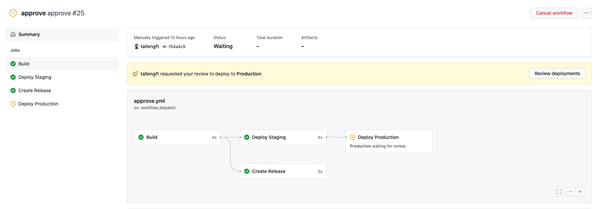
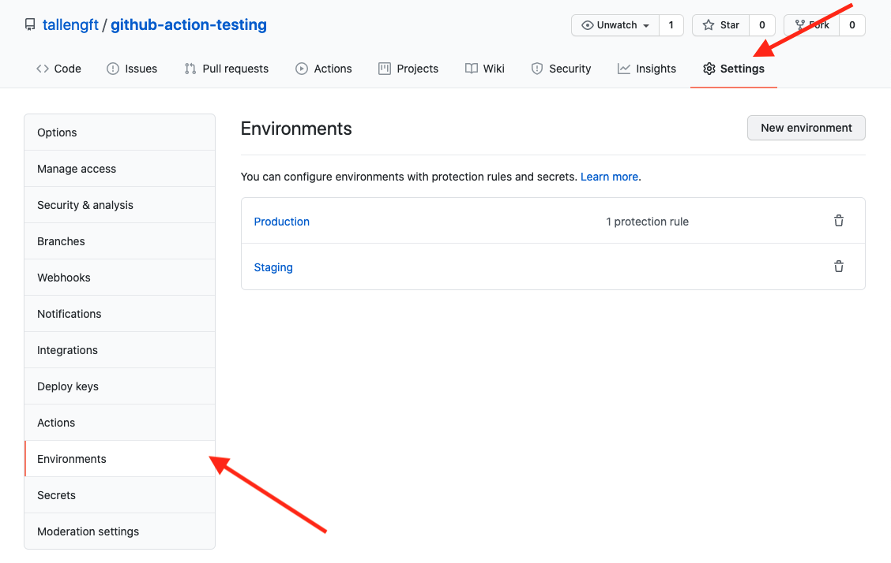
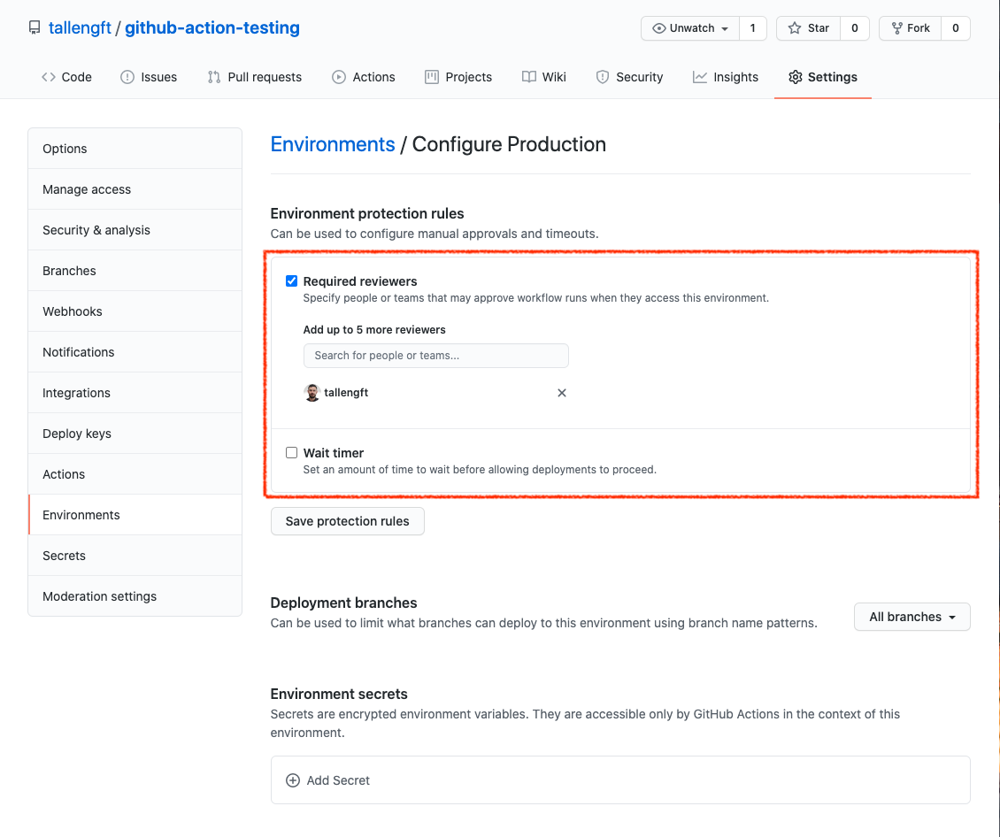
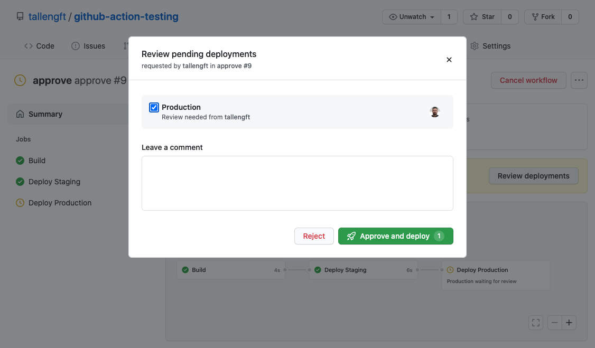

# github-action-testing

# Git Hub Workflow Approval
Example of a simple workflow that simulates using GitHub environments with an approval step:



Adding an `environment` variable to each specifies the envrioment that the job references. You can provide the environment as only the environment `name`, or as an environment object with the `name` and `url`. The URL maps to environment_url in the deployments API.

```yml
environment: staging_environment
```

```
environment:
  name: production_environment
  url: https://github.com
```

The URL can be an expression and can use any context except for the secrets context. For more information about expressions, see ["Context and expression syntax for GitHub Actions."](https://docs.github.com/en/actions/reference/context-and-expression-syntax-for-github-actions)

If the environment does not exist it will be created automatically, you can manually create/edit environment via GitHub by going to the repositories `settings` page and selecting `Environments`:



If you wish to add an approval for a environment, such as production, you can manually specify this via the github environment page to add up to 6 reviewers:



This will require one of the users to manually approve the workflow before it can proceed with the GitHub Action job using that environment, the approvers will receive an email notifying them of a new approval request:



---

# Permissions for workflow_dispatch
It is possible to disable workflow jobs with an IF statement on each job, such as

```yml
jobs:
  PR-Comment:
    if: github.actor != 'kingthorin' && github.actor != 'wstgbot' && github.actor != 'ThunderSon' && github.actor != 'rejahrehim' && github.actor != 'victoriadrake'  
    runs-on: ubuntu-latest
    steps:
    - name: PR Comment
```
